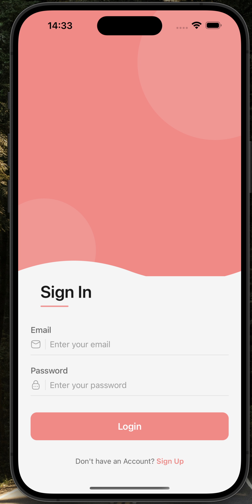
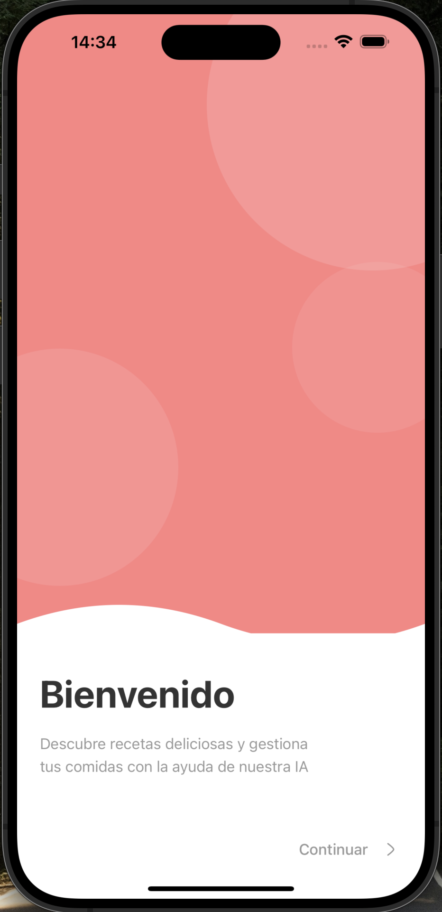
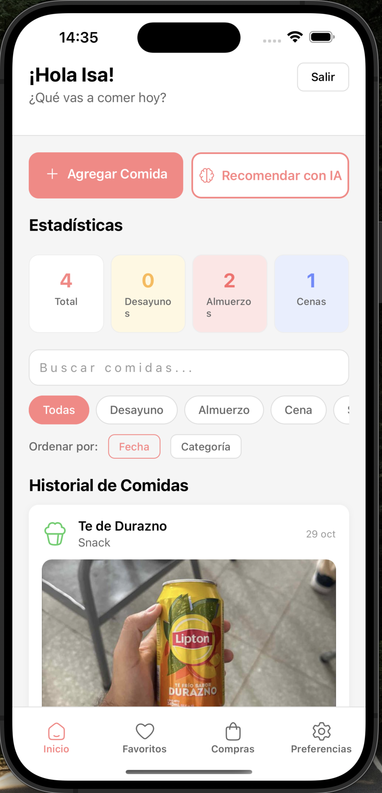

# Meal Buddy App - React Native + Expo

Meal Buddy es una aplicación móvil de recomendaciones de comidas con IA que te ayuda a descubrir qué comer cada día.

## 📱 Vista Previa

<div align="center">
  
  
  
</div>

## 🚀 Características

- **Autenticación con Email/Teléfono**: Login seguro con OTP
- **Recomendaciones con IA**: Sugerencias personalizadas usando Google Gemini AI
- **Historial de Comidas**: Registra y consulta tus comidas con fotos
- **Navegación tipo WhatsApp**: Tabs inferiores para acceso rápido
- **Sistema de Favoritos**: Guarda tus recetas favoritas
- **Lista de Compras**: Gestiona ingredientes y compras
- **Preferencias Alimentarias**: Personaliza restricciones, alergias y gustos
- **Notificaciones**: Recordatorios de comidas personalizables
- **Temas Claro/Oscuro**: Personaliza la apariencia de la app
- **Almacenamiento de Imágenes**: Fotos optimizadas guardadas en SQLite
- **Multiplataforma**: Funciona en iOS y Android con Expo Go

## 📋 Requisitos Previos

- Node.js 18+ instalado
- npm o yarn
- Expo Go app instalada en tu dispositivo iOS o Android
- Cuenta de Firebase (para autenticación)
- API Key de Google Gemini (para recomendaciones con IA)
- Cuenta de email para envío de OTP (Gmail, Outlook, etc.)

## 🛠️ Instalación

1. **Clonar o navegar al proyecto:**
   ```bash
   cd meal-buddy-app
   ```

2. **Instalar dependencias del frontend:**
   ```bash
   npm install
   ```

3. **Instalar dependencias del backend:**
   ```bash
   cd backend
   npm install
   cd ..
   ```

4. **Configurar variables de entorno del frontend:**

   Crea un archivo `.env` en la raíz del proyecto:

   ```env
   # API URL (desarrollo local)
   EXPO_PUBLIC_API_URL=http://localhost:3000/api

   # Firebase Configuration (para autenticación)
   EXPO_PUBLIC_FIREBASE_API_KEY=tu_firebase_api_key
   EXPO_PUBLIC_FIREBASE_AUTH_DOMAIN=tu-proyecto.firebaseapp.com
   EXPO_PUBLIC_FIREBASE_PROJECT_ID=tu-proyecto-id
   EXPO_PUBLIC_FIREBASE_STORAGE_BUCKET=tu-proyecto.appspot.com
   EXPO_PUBLIC_FIREBASE_MESSAGING_SENDER_ID=tu_sender_id
   EXPO_PUBLIC_FIREBASE_APP_ID=tu_app_id
   ```

5. **Configurar variables de entorno del backend:**

   Crea un archivo `.env` en la carpeta `backend/`:

   ```env
   # Puerto del servidor
   PORT=3000

   # JWT Secret (genera uno aleatorio)
   JWT_SECRET=tu_secreto_super_seguro

   # Google Gemini API
   GEMINI_API_KEY=tu_gemini_api_key

   # Configuración de Email (para OTP)
   EMAIL_USER=tu_email@gmail.com
   EMAIL_PASSWORD=tu_app_password

   # Firebase Admin SDK (opcional, para verificación adicional)
   FIREBASE_PROJECT_ID=tu-proyecto-id
   FIREBASE_PRIVATE_KEY=tu_private_key
   FIREBASE_CLIENT_EMAIL=tu_service_account_email
   ```

## 🔥 Configuración de Firebase

1. **Crear proyecto en Firebase:**
   - Ve a [Firebase Console](https://console.firebase.google.com/)
   - Crea un nuevo proyecto
   - Activa **Authentication** y habilita el método de **Phone**
   - Activa **Cloud Firestore**

2. **Configurar autenticación por teléfono:**
   - En Firebase Console → Authentication → Sign-in method
   - Habilita "Phone"
   - Para iOS: Configura las App Store Restrictions (opcional para desarrollo)

3. **Configurar Firestore:**
   - Ve a Firestore Database
   - Crea la base de datos en modo de prueba (o producción con reglas)

   **Reglas de seguridad recomendadas:**
   ```javascript
   rules_version = '2';
   service cloud.firestore {
     match /databases/{database}/documents {
       match /users/{userId} {
         allow read, write: if request.auth != null && request.auth.uid == userId;

         match /meals/{mealId} {
           allow read, write: if request.auth != null && request.auth.uid == userId;
         }

         match /subscription/{document=**} {
           allow read: if request.auth != null && request.auth.uid == userId;
           allow write: if false; // Solo el backend puede escribir
         }
       }
     }
   }
   ```

4. **Obtener credenciales:**
   - Ve a Project Settings → General
   - En "Your apps", registra una app iOS y/o Android
   - Copia las credenciales a tu archivo `.env`

## 📱 Ejecutar la App

### Opción 1: Usando el script de desarrollo (Recomendado)

1. **Iniciar backend y frontend simultáneamente:**
   ```bash
   npm run dev
   ```
   Este comando inicia el backend en el puerto 3000 y el frontend con Expo.

### Opción 2: Iniciar manualmente

1. **Iniciar el backend (Terminal 1):**
   ```bash
   cd backend
   npm start
   ```

2. **Iniciar el frontend (Terminal 2):**
   ```bash
   npm start
   ```

3. **Escanear el QR:**
   - **iOS**: Abre la app de Cámara y escanea el código QR
   - **Android**: Abre Expo Go y escanea el código QR

### En Simulador/Emulador

```bash
# iOS (requiere Mac con Xcode)
npm run ios

# Android (requiere Android Studio)
npm run android
```

## 📁 Estructura del Proyecto

```
meal-buddy-app/
├── backend/              # Servidor Node.js + Express
│   ├── src/
│   │   ├── controllers/  # Controladores de autenticación
│   │   ├── models/       # Modelos de base de datos (SQLite)
│   │   ├── routes/       # Rutas de API
│   │   │   ├── auth.js
│   │   │   ├── meals.js
│   │   │   ├── recommendations.js
│   │   │   ├── favorites.js
│   │   │   └── shopping-list.js
│   │   ├── utils/        # Utilidades (email, etc.)
│   │   └── index.js      # Entry point del servidor
│   ├── data/             # Base de datos SQLite
│   │   └── mealbuddy.db
│   └── package.json
├── src/
│   ├── components/       # Componentes reutilizables
│   │   ├── NotificationSettings.tsx
│   │   └── ThemeSelector.tsx
│   ├── config/           # Configuración (Firebase, etc.)
│   │   └── firebase.ts
│   ├── contexts/         # Contextos de React
│   │   └── ThemeContext.tsx
│   ├── hooks/            # Custom hooks de React
│   │   ├── useAuth.tsx
│   │   └── useTheme.tsx
│   ├── navigation/       # Navegación de la app
│   │   ├── AppNavigator.tsx
│   │   ├── BottomTabNavigator.tsx
│   │   └── types.ts
│   ├── screens/          # Pantallas principales
│   │   ├── WelcomeScreen.tsx
│   │   ├── AuthScreen.tsx
│   │   ├── DashboardScreen.tsx
│   │   ├── PreferencesScreen.tsx
│   │   ├── FavoritesScreen.tsx
│   │   └── ShoppingListScreen.tsx
│   └── services/         # Servicios y lógica de negocio
│       ├── meals.ts      # API de comidas
│       ├── favorites.ts  # API de favoritos
│       ├── shoppingList.ts
│       ├── images.ts     # Manejo de imágenes
│       └── notifications.ts
├── App.tsx               # Componente principal
├── package.json
└── .env                  # Variables de entorno (crear)
```

## 🎯 Funcionalidades Principales

### Autenticación
- Login con email o número de teléfono
- Verificación OTP enviada por email
- Gestión automática de sesión con JWT
- Firebase Authentication para seguridad adicional

### Navegación
- **Tabs inferiores estilo WhatsApp iOS**:
  - Inicio: Dashboard con comidas
  - Favoritos: Recetas guardadas
  - Compras: Lista de compras
  - Preferencias: Configuración de usuario

### Dashboard
- Agregar comidas con categoría (Desayuno, Almuerzo, Cena, Snack)
- **Subir fotos** optimizadas desde cámara o galería
- Ver historial de comidas con búsqueda y filtros
- Estadísticas por categoría de comida
- Sistema de pull-to-refresh

### Recomendaciones con IA
- Integración con **Google Gemini AI**
- Sugerencias personalizadas basadas en:
  - Historial de comidas
  - Preferencias alimentarias
  - Restricciones dietéticas
  - Alergias
  - Cocinas favoritas
- Recetas completas con ingredientes e instrucciones
- Tiempo de preparación y dificultad

### Favoritos
- Guardar recetas favoritas
- Ver detalles completos
- Compartir recetas
- Agregar ingredientes a lista de compras

### Lista de Compras
- Agregar items manualmente
- Importar ingredientes desde recetas
- Marcar items como comprados
- Categorización automática
- Compartir lista completa
- Limpiar items comprados

### Preferencias
- **Restricciones dietéticas**: Vegetariano, vegano, sin gluten, etc.
- **Alergias**: Gestión de alérgenos
- **Cocinas favoritas**: Italiana, mexicana, asiática, etc.
- **Alimentos que no te gustan**
- **Notificaciones**: Configurar recordatorios por comida
- **Tema**: Modo claro, oscuro o automático

### Almacenamiento de Imágenes
- Fotos optimizadas automáticamente para iPhone de alta resolución
- Redimensionamiento a 800px de ancho
- Compresión inteligente (~100-300KB por imagen)
- Almacenamiento en SQLite como base64
- Sin dependencia de servicios externos

## 🔧 Scripts Disponibles

```bash
# Iniciar backend y frontend simultáneamente
npm run dev

# Iniciar solo el frontend
npm start

# Iniciar solo el backend
npm run backend

# Ejecutar en iOS
npm run ios

# Ejecutar en Android
npm run android

# Limpiar caché de Expo
npm start -- --clear
```

## ⚠️ Problemas Comunes

### Backend no se conecta
Si la app no se conecta al backend:
- Verifica que el backend esté corriendo en `http://localhost:3000`
- En dispositivos físicos, usa la IP de tu computadora en lugar de `localhost`
- Asegúrate de que `EXPO_PUBLIC_API_URL` esté correctamente configurado

### Error al subir imágenes
Si recibes error "Payload Too Large":
- El backend ya está configurado para aceptar hasta 10MB
- Las imágenes se optimizan automáticamente a ~100-300KB
- Reinicia el backend si acabas de actualizar

### Error de Firebase en iOS
Si recibes errores de autenticación en iOS:
- Asegúrate de que el Bundle ID de tu app coincida con el configurado en Firebase
- Verifica que reCAPTCHA esté configurado correctamente

### Error de módulos nativos
Si encuentras errores con módulos nativos:
```bash
# Limpiar caché de Expo
npm start -- --clear

# O reinstalar dependencias
rm -rf node_modules
npm install
```

### Variables de entorno no cargadas
- Asegúrate de que el archivo `.env` esté en la raíz del proyecto y en `backend/`
- Reinicia el servidor de desarrollo después de modificar `.env`
- Las variables del frontend deben comenzar con `EXPO_PUBLIC_`

### Error con expo-file-system
Si ves warnings sobre API deprecada:
- Ya está configurado para usar la API legacy
- El warning es normal y no afecta la funcionalidad

## 🚀 Deployment

### Build para iOS
```bash
# Crear build de desarrollo
eas build --profile development --platform ios

# Crear build de producción
eas build --profile production --platform ios
```

### Build para Android
```bash
# Crear build de desarrollo
eas build --profile development --platform android

# Crear build de producción
eas build --profile production --platform android
```

**Nota:** Necesitas configurar EAS (Expo Application Services) para hacer builds. Visita [docs.expo.dev/build/setup](https://docs.expo.dev/build/setup/) para más información.

## 📚 Recursos

- [Documentación de Expo](https://docs.expo.dev/)
- [Documentación de React Native](https://reactnative.dev/)
- [Documentación de Firebase](https://firebase.google.com/docs)
- [Documentación de React Navigation](https://reactnavigation.org/)
- [OpenAI API](https://platform.openai.com/docs)

## 🤝 Contribuir

Las contribuciones son bienvenidas. Para cambios importantes:

1. Haz fork del proyecto
2. Crea una rama para tu feature (`git checkout -b feature/AmazingFeature`)
3. Commit tus cambios (`git commit -m 'Add some AmazingFeature'`)
4. Push a la rama (`git push origin feature/AmazingFeature`)
5. Abre un Pull Request

## 📝 Licencia

Este proyecto es privado y está en desarrollo.

## 👨‍💻 Soporte

Si tienes problemas o preguntas:
1. Revisa la sección de Problemas Comunes
2. Consulta la documentación de Expo y Firebase
3. Crea un issue en el repositorio

---

Desarrollado con ❤️ usando React Native y Expo
